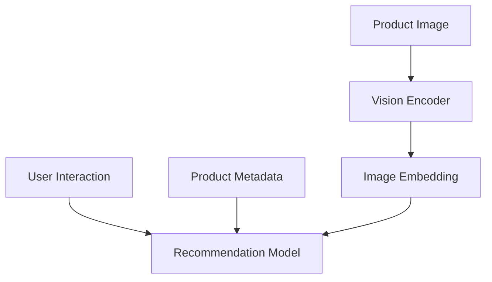

AI Personal Fashion Assistant

사용자 행동 데이터와 패션 상품의 시각적 정보를 활용하여 개인화된 패션 추천을 제공하는 AI 기반 패션 추천 시스템

📌 Project Overview

온라인 패션 쇼핑에서 사용자는 상품 이미지와 모델 착용 사진을 기반으로 구매 결정을 내려야 합니다.

하지만 상품이 자신의 취향과 스타일에 맞는지 구매 전에 판단하기 어렵고, 이러한 불확실성으로 인해 자신에게 익숙한 스타일만 반복적으로 선택하거나 쇼핑 실패를 경험할 수 있습니다.

이 프로젝트는 사용자의 행동 데이터와 패션 상품의 다양한 정보를 분석하여 개인에게 적합한 패션 상품을 추천하는 AI 기반 Personal Fashion Assistant를 구축하는 것을 목표로 합니다.

⸻

🎯 Project Goal

본 프로젝트의 장기적인 목표는 단순한 상품 추천 시스템을 넘어,

사용자의 패션 취향과 스타일을 지속적으로 이해하고, 개인에게 적합한 상품을 추천하며 새로운 스타일을 부담 없이 탐색할 수 있도록 돕는 AI Personal Fashion Assistant를 구축하는 것

입니다.

현재 프로젝트에서는 다음과 같은 기술적 문제에 집중합니다.

상품 이미지에서 추출한 시각적 특징(Image Embedding)을 추천 시스템에 활용했을 때, 기존의 사용자 행동 및 상품 메타데이터 기반 추천보다 개인화 추천 성능을 개선할 수 있는가?

⸻

🔍 Problem

기존 패션 추천은 주로 다음과 같은 정보를 활용합니다.

* User Interaction
* Purchase History
* Product Metadata

하지만 패션 상품은 색상, 패턴, 핏, 실루엣 등 시각적인 특징이 중요한 상품입니다.

따라서 본 프로젝트에서는 상품 이미지를 Computer Vision 모델로 분석하여 시각적 특징을 추출하고 추천 과정에 활용합니다.

⸻

🧠 Core Approach

프로젝트는 단순한 모델부터 단계적으로 발전시킵니다.

1. Popularity Recommendation

상품 구매 횟수를 기반으로 인기 상품을 추천합니다.

2. Collaborative Filtering

사용자와 상품 간의 Interaction을 활용하여 개인화된 상품을 추천합니다.

3. Image-based Recommendation

상품 이미지에서 추출한 Image Embedding을 활용하여 시각적으로 유사한 상품을 추천합니다.

4. Multimodal Recommendation

다양한 정보를 결합하여 개인화 추천을 수행합니다.

User Behavior
        +
Product Metadata
        +
Product Image Embedding
        ↓
Multimodal Recommendation
        ↓
Top-K Recommendation

⸻

📊 Dataset

H&M Personalized Fashion Recommendations

본 프로젝트에서는 H&M Personalized Fashion Recommendations 데이터셋을 활용합니다.

주요 데이터:

* Customer Data — 사용자 정보
* Product Data — 상품 메타데이터
* Transaction Data — 사용자 구매 기록
* Product Images — 패션 상품 이미지

Data Limitation

현재 데이터셋에는 실제 사용자의 키, 몸무게, 신체 치수 등의 정보가 포함되어 있지 않습니다.

따라서 현재 프로젝트에서는 실제 체형 기반 추천을 구현하지 않으며, 사용자 행동 데이터와 상품 정보를 활용한 개인화 추천에 집중합니다.

⸻

🏗️ Project Structure

fashion-recommendation-system/
│
├── configs/          # Configuration files
│
├── data/
│   ├── raw/          # Raw data
│   ├── interim/      # Intermediate data
│   ├── processed/    # Processed data
│   └── embeddings/   # Image embeddings
│
├── notebooks/        # EDA and experiments
│
├── src/
│   ├── data/         # Data loading and preprocessing
│   ├── features/     # Feature engineering
│   ├── models/       # Recommendation models
│   ├── evaluation/   # Evaluation metrics
│   ├── pipeline/     # Training and inference pipelines
│   └── utils/        # Utility functions
│
├── scripts/          # Executable scripts
├── experiments/      # Experiment records
├── results/          # Model results and figures
├── tests/            # Tests
└── docs/             # Project documentation

⸻

🛠 Tech Stack

AI / Machine Learning

* Python
* PyTorch
* Scikit-learn

Computer Vision

* CLIP

Recommendation System

* Collaborative Filtering
* Content-based Recommendation
* Multimodal Recommendation

Data Processing

* Pandas
* NumPy

Vector Search

* FAISS

Deployment

* FastAPI
* Streamlit

기술 스택은 프로젝트 진행 과정에서 변경될 수 있습니다.

⸻

📈 Evaluation

추천 모델은 다음 지표를 활용하여 평가합니다.

* Precision@K
* Recall@K
* NDCG@K
* MAP@K

여러 모델을 동일한 평가 환경에서 비교하여 성능 변화를 분석합니다.

⸻

🗺️ Roadmap

* [ ]	Dataset Setup
* [ ]	Exploratory Data Analysis
* [ ]	Data Preprocessing
* [ ]	Popularity Recommendation
* [ ]	Collaborative Filtering
* [ ]	Recommendation Evaluation
* [ ]	Product Image Analysis
* [ ]	Image Embedding Generation
* [ ]	Similar Item Search
* [ ]	Content-based Recommendation
* [ ]	Multimodal Recommendation
* [ ]	Model Comparison
* [ ]	Error Analysis
* [ ]	API Development
* [ ]	Frontend Development

Future Work

* [ ]	User Style Profiling
* [ ]	Style Exploration
* [ ]	Body-aware Recommendation
* [ ]	Virtual Try-On

⸻

🌱 Development Principles

이 프로젝트는 다음 원칙을 따릅니다.

* Start Simple — 복잡한 모델보다 Baseline부터 시작합니다.
* Baseline First — 모든 모델은 비교 기준을 가집니다.
* Experiment-driven — 가설을 설정하고 실험 결과를 분석합니다.
* Avoid Data Leakage — 데이터 분할 과정에서 미래 정보가 학습에 포함되지 않도록 합니다.
* Do Not Overclaim — 데이터와 모델이 실제로 지원하지 않는 기능을 과장하지 않습니다.

⸻

🔀 Git Convention

Branch

feature/<feature-name>
fix/<issue-name>
docs/<document-name>
refactor/<module-name>

Example:

feature/data-eda
feature/collaborative-filtering
feature/image-embedding
feature/multimodal-model

Commit

Type	Description
feat	새로운 기능
fix	버그 수정
docs	문서 수정
refactor	코드 구조 개선
test	테스트 추가 및 수정
chore	환경 설정 및 기타 변경

Example:

feat: add popularity recommendation model
feat: implement collaborative filtering
feat: generate product image embeddings
fix: correct transaction preprocessing
docs: update README

⸻

🚧 Current Status

Project Setup

현재 프로젝트는 초기 설계 및 개발 환경 구축 단계입니다.

Next Step:

Dataset Setup
      ↓
EDA
      ↓
Data Preprocessing
      ↓
Baseline Recommendation

⸻

🎯 Final Vision

사용자의 패션 취향과 행동을 지속적으로 이해하고, 개인에게 적합한 스타일을 추천하며, 새로운 스타일을 부담 없이 탐색할 수 있도록 돕는 AI Personal Fashion Assistant를 구축합니다.
